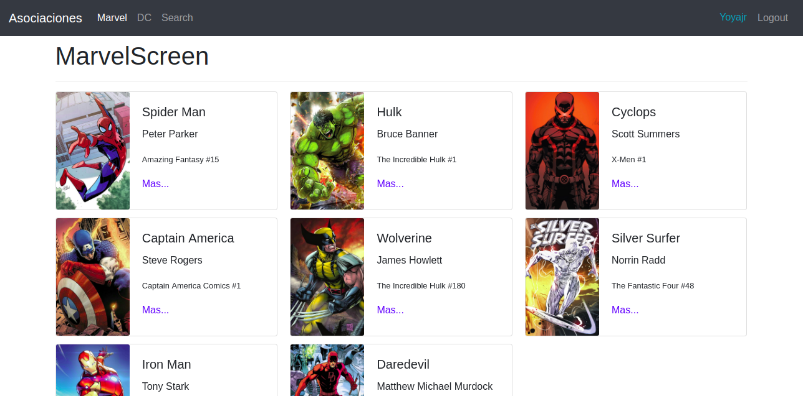
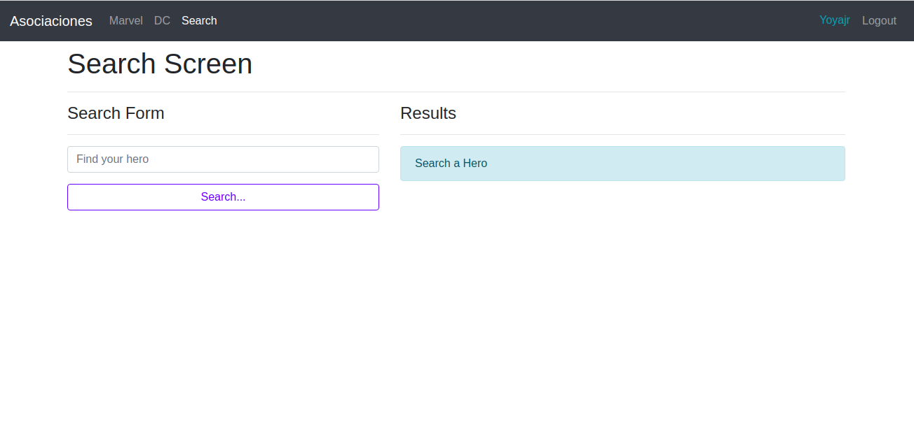

Heroes App es una single-page application (SPA) , construida con React, JavaScript y CSS. Usando React Router para crear rutas privadas y públicas además de Context API y Reducer para manejar el estado de la app.

Capturas de pantalla del proyecto

Link para acceder a la app

https://yoya93.github.io/heroes-app/

Instrucciones de instalación y configuración

Clona este repositorio. Necesitará node y npm instalada a nivel global en su máquina.

Instalación:

npm install

Para iniciar el servidor:

npm start

Para visitar la aplicación:

localhost:3000/

